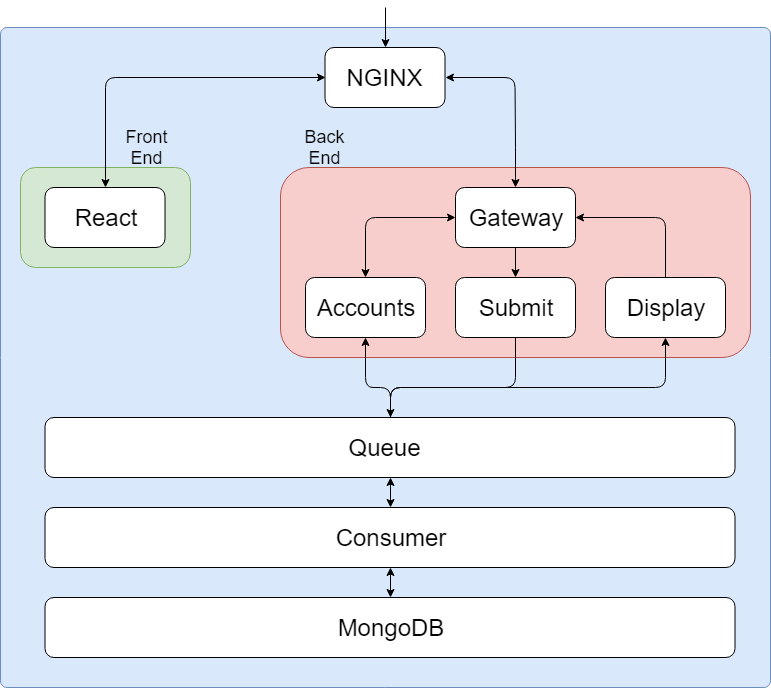

## Contributors
* [Joel Halford](https://github.com/JoelHalford): Front End
* [Fortune Osadolor](https://github.com/FortunexFortune): Back End
* [Ahmed Abid Ali](https://github.com/ahmedQAC): Back End
* [Taoheed Afolayan](https://github.com/Taoheed1): Testing
* [Ian Mallinson](https://github.com/imallinson): CI/CD

## Index
1. [Project Definition](#1-Project-Definition)

2. [Architecture](#2-Architecture)
     
3. [Containers](#3-Containers)
   * [NGINX](#NGINX)
   * [React Front End](#React-Front-End)
   * [Gateway](#Gateway)
   * [Accounts](#Accounts)
   * [Cohorts](#Cohorts)
   * [Form Submit](#Form-Submit)
   * [Data Retriver](#Data-Retriever)
   * [ActiveMQ](#ActiveMQ)
   * [Consumer](#Consumer)
   * [MongoDB](#MongoDB)
     
4. [Testing](#4-Testing)
   * [Unit Testing](#Unit-Testing)
   * [Acceptance Testing](#Acceptance-Testing)

5. [How To Run](#5-How-To-Run)
   * [Prerequisites](#Prerequisites)
   * [Steps](#Steps)

6. [Continuous Integration](#6-Continuous-Integration)

# 1. Project Definition

# 2. Architecture

Each white box in the diagram is a docker container

# 3. Containers
## NGINX
NGINX handles routing the user to the front end and routing the front end requests to the Gateway API. It also redirects all traffic to HTTPS to implement SSL for all connections.

## React
[ReactJS](https://reactjs.org/) has been used to build the front end for the app. It utilises a single page with routes to direct to the various views in the app.

## Gateway

## Accounts
This microservice deals with both account creation and retrieval. Account data is retrieved for logging into the app as well as when feedback is viewed.

## Cohorts

## Form Submit
This microservice deals with persisting the feedback forms sent from the front end.

## Data Retriever

## ActiveMQ

## Consumer
This microservice listens to the queue and sends any requests in the queue to the database.

## MongoDB

# 4. Testing
## Unit Testing

## Acceptance Testing

# 5. How To Run
## Prerequisites
* [Docker](https://hub.docker.com/search/?type=edition&offering=community)
* [Docker Compose](https://github.com/docker/compose/releases)
* A Shell Terminal

## Steps
1. Clone this repo
2. Run the install.sh script

# 6. Continuous Integration

